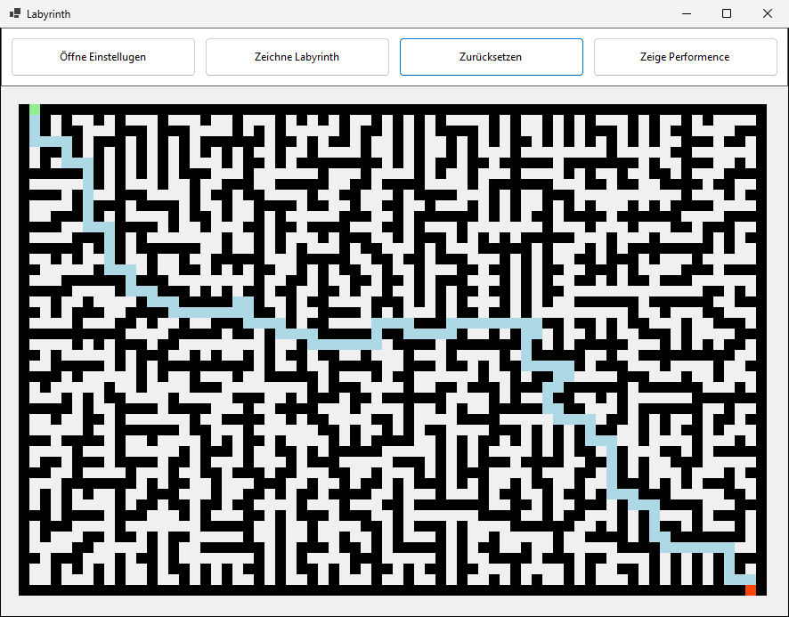
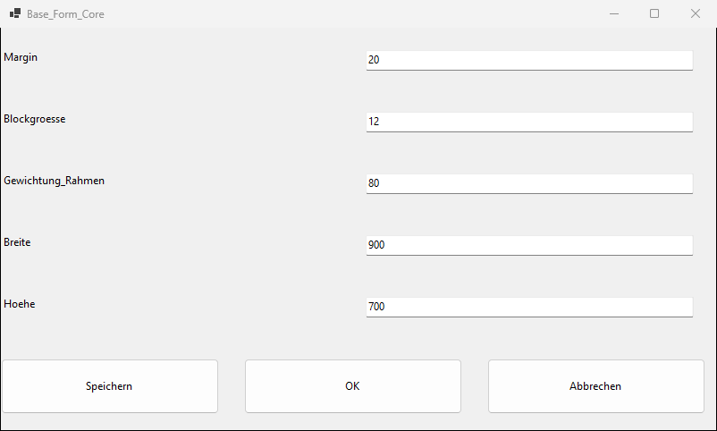
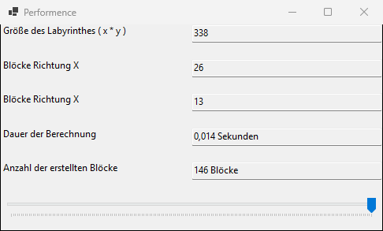

# Labyrinth

Ein Labyrinth-Generator mit automatischer Wegfindung in C# und Windows Forms. Er ist eines meiner ersten Programmierprojekte und entstand im November 2021, in der Anfangszeit meiner Programmierlaufbahn.

Wie schon beim Taschenrechner aus meinem Praktikum gilt auch hier: Der Code zeigt, wo ich damals stand – mit allem, was man als Anfänger eben so macht.



## Features

- **Zufällige Labyrinthe** in frei wählbarer Größe, mit Start (grün) oben links und Ziel (rot) unten rechts
- **Automatische Wegfindung:** Das Programm läuft das Labyrinth mit der „Linke-Hand-Regel“ ab, also immer an der linken Wand entlang. Anschließend werden alle Sackgassen aus dem gelaufenen Weg entfernt, sodass nur der direkte Lösungsweg (hellblau) übrig bleibt.
- **Einstellungen,** die sich selbst aufbauen: Die Eingabemaske wird per Reflection automatisch aus den Properties der Einstellungsklasse erzeugt, gesteuert über eigene Attribute (`Custom_Layout`, `Custom_Ignore`, `Custom_Einheit`). Gespeichert und geladen werden die Einstellungen über einen ebenso generischen Export und Import.
- **Performance-Ansicht** mit Größe des Labyrinths, Anzahl der Blöcke und Berechnungsdauer. Über einen Schieberegler lassen sich der Aufbau des Labyrinths und die anschließende Wegsuche Schritt für Schritt nachverfolgen.

| Einstellungen | Performance |
|---|---|
|  |  |

## Originalzustand und spätere Änderungen

Der Code ist im Wesentlichen so belassen, wie er 2021 entstanden ist – inklusive Tippfehlern wie „Performence“ oder „Einstellugen“ und unfertiger Teile wie `_Baustelle/Editor.cs`.

Damit sich das Projekt heute noch bauen und starten lässt, wurde es 2026 auf .NET 10 umgestellt. Dabei wurden die Hilfsklassen aus dem früheren Unterordner `HelperKlassenX` direkt ins Projekt übernommen (Namespace `Labyrinth`), und der Quellcode liegt jetzt unter `src/`. Den unveränderten Originalstand gibt es unter dem Tag [`original-2021`](https://github.com/FrederikHartung/Labyrinth/tree/original-2021).

## Was ich heute anders machen würde

- **Eine Klasse für alles:** `Canvas.cs` (fast 1.000 Zeilen) erzeugt das Labyrinth, löst es und zeichnet es. Heute würde ich Generierung, Wegfindung und Darstellung in getrennte Klassen aufteilen – dann ließen sich die Algorithmen auch unabhängig von der Oberfläche testen.
- **Globaler Zustand:** Einstellungen liegen in einer statischen Klasse, deren Setter direkt die Fenstergröße des Hauptfensters ändern, und das Hauptfenster selbst ist global über `Helper.Mainform` erreichbar. Heute würde ich Abhängigkeiten explizit übergeben.
- **Eigene Serialisierung:** Für das Speichern der Einstellungen habe ich einen kompletten Export/Import per Reflection in Textdateien geschrieben. Das war lehrreich – heute würde ich einfach `System.Text.Json` verwenden.
- **Auskommentierter Code:** Alte Lösungsansätze stehen noch als große auskommentierte Blöcke im Code. Dafür ist eigentlich die Versionsverwaltung da.
- **Wegfindung:** Die Linke-Hand-Regel läuft erst einmal jede Sackgasse ab, die auf ihrem Weg liegt, und braucht deshalb den nachträglichen Aufräumschritt. Eine Breitensuche (BFS) würde den kürzesten Weg direkt finden.
- **Starres Layout:** Die Buttons teilen sich die Fensterbreite. Bei kleinen Fenstern werden die Beschriftungen abgeschnitten.
- **Keine Tests:** Gerade Generierung und Wegfindung wären ideal für Unit-Tests gewesen.

## Projekt starten

**Voraussetzungen:** Windows und das [.NET 10 SDK](https://dotnet.microsoft.com/download).

### Mit dem .NET SDK

Im Repo-Ordner:

```powershell
dotnet run --project src
```

### Mit Visual Studio

1. Visual Studio 2026 mit dem Workload **„.NET-Desktopentwicklung“** installieren.
2. `Labyrinth.sln` öffnen.
3. Mit **F5** starten.

Beim allerersten Start erscheint der Hinweis, dass keine Einstellungsdatei gefunden wurde – das ist normal. Gespeicherte Einstellungen landen im Ordner `Exporthelper` neben der `.exe`.

## Lizenz

© 2021 Frederik Hartung – alle Rechte vorbehalten. Der Code ist nur zur Ansicht veröffentlicht; jede Nutzung erfordert meine ausdrückliche Erlaubnis. Details siehe [LICENSE](LICENSE).
